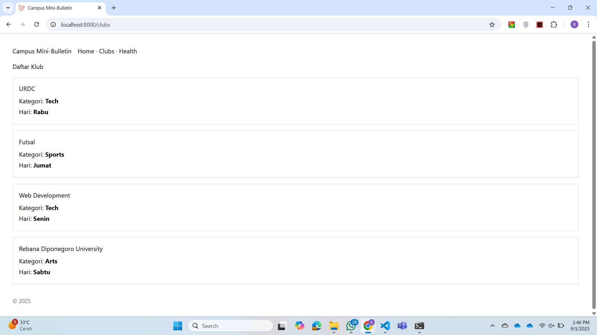

# Campus Bulletin

Proyek ini adalah aplikasi berbasis **Laravel 12** dengan **Vite** sebagai bundler frontend.  
Berikut panduan untuk menjalankan aplikasi secara lokal.

---

## 🚀 Cara Menjalankan

### 1. Clone Repository
* bash
git clone https://github.com/username/campus-bulletin.git
cd campus-bulletin

### 2. Install Dependency
composer install
npm install

### 3. Copy File Environment
cp .env.example .env

### 4. Generate Key
php artisan key:generate

### 5. Migrate Database
php artisan migrate

### 6. Jalankan Server
php artisan serve
npm run dev

## 🛠 Tech Stack
- PHP (Laravel + Blade)
- Vite
- HTML5
- CSS
- JavaScript

---

## Screenshot

### Tampilan /clubs

### Tampilan Output php artisan route:list

---
